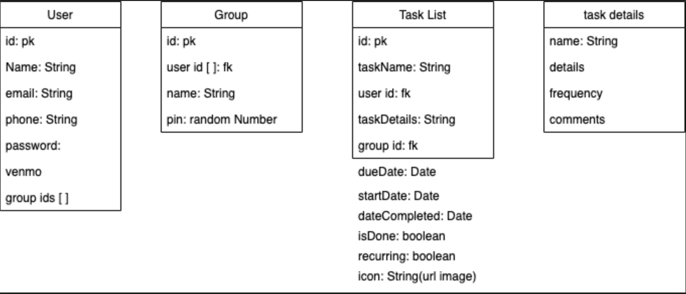
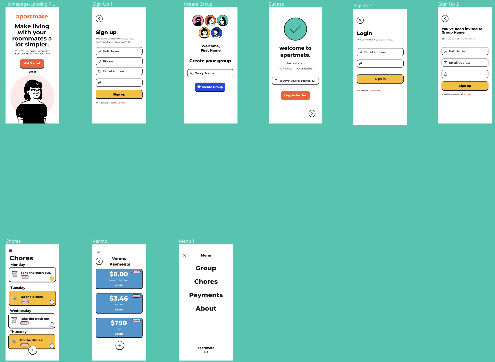

# Welcome to Apartmate!

## Getting Started

To run Apartmate on your local machine, go ahead and fork and clone the backend and frontend repo from github. Then install the dependencies needed for both sides by running ```npm i ``` in your terminal. 
Then create a .env to keep your REACT_APP_SERVER_URL, JWT_SECRET and MONGO_URI.

In order to run the backend repo, you need to input ```nodemon``` in the backend terminal and for the client/frontend repo, you need to run ```npm start```. 

# About Our Project 
## ERD
For our ERD, this was our blueprint layer and as we created our API, a few things had to be changed as we realized we were able to group things differently. However, this helped us get our API started and see what we needed starting out. 



## Wireframe

We started out with a basic idea of how we wanted Apartmate to look like and like any ideas, we knew it would change as we went on but wanted to stick to the original wireframe. We wanted to keep our app simplistic as we didn't want any of too much styling to take away from the functionality of our app. We did add in a toggle to switch from light mode to dark mode as well since it is a very popular option offered in cellphones. 



# Code Snippets/Information

Chores Main Logic

The Frontend portion of the project was mainly spent on the chores page logic. The Chores section was broken into 3 components: Todo.js, TodoForm.js, and TodoList.js.  We first set up a form using Material UI, created the onClick functions, and set variables using state. We tested basic functions to ensure that our logic made sense on the page. The next step was to connect the frontend with the backend using axios calls. The code below shows a form on TodoForm.js to add a new chore and connects it to the post route on the chores model. 

```javascript
function TodoForm(props) {
	const [input, setInput] = useState(props.edit ? props.edit.value : '');
	const thisUser = props.user;
	const [taskDetail, setTaskDetail] = useState('');
	const group = props.groupId;
	const [rep, isRep] = useState(true);
	const handleInput = e => {
		setInput(e.target.value);
	};

	const handleDetail = e => {
		setTaskDetail(e.target.value);
	};

	const handleSubmit = e => {
		e.preventDefault();

		axios.post(`${REACT_APP_SERVER_URL}/chores/new`, {
				input,
				thisUser,
				taskDetail,
				group,
				rep,
			})
			.catch(err => console.log(`Post chore error:`, err));

		props.onSubmit({
			id: Math.floor(Math.random() * 10000),
			taskName: input,
			taskDetail: taskDetail,
		});
		setInput('');
		setTaskDetail('');
	};

	return (
		<form onSubmit={handleSubmit} className='todo-form'>
			{props.edit ? (
				<>
					<input
						placeholder='Update your item'
						value={input}
						onChange={handleInput}
						name='taskName'
						// ref={inputRef}
						className='todo-input edit'
					/>
					<button onClick={handleSubmit} className='todo-button edit'>
						Update
					</button>
				</>
```

## Technologies and Libraries We Used
Frontend
* Material UI
* Axios
* JWT Decode
* React
* React-Copy-to-Clipboard
* React-Responsive-Carousel
* React-router-dom

Backend
* axios
* bcryptjs
* cors
* express
* jsonwebtoken
* mongoose
* mongoose-float
* node-schedule
* passport
* passport-jwt
* twilio
* node-schedule

## Features
* MERN Auth
* Sessions to keep user logged in between pages
* MERN stack
* Venmo payment connected to each user
* Reference models
* CRUD functionality

# Models

## User Model

| Column Name | Data Type | Purpose |
| ---- | ------ | -------------------------- |
| Name | String | This has to be provided upon signing up & log in |
| Email | String | This must be provided upon signing up & to log in |
| Password | String | Must be provided | 
| Phone | String | Must be provided for us of Venmo |
| Venmo | String | Default |
| Group Id | Auto-generated |  ObjectId |
| Completed Chore | String | ObjectId |
| Date | Date | Auto-generated |

## Group Model

| Column Name | Data Type | Purpose |
| ---- | ------ | -------------------------- |
| Users | String | This has to be provided upon signing up & log in |
| Name | String | Must be provided |
| Pin | Integer | Must be provided | 
| Date | Date | Auto-generated |

## Venmo Model 

| Column Name | Data Type | Purpose |
| ---- | ------ | -------------------------- |
| Primary Venmo | String | Must be provided |
| Item | String | Default |
| Input Price | Float | user will create this later | 
| Users | String | ObjectId |
| Group Id | | Auto-generated |
|Split Price | Float | user will create this later |
|Date | Date |  Auto-generated |

## Chore Model 

| Column Name | Data Type | Purpose |
| ---- | ------ | -------------------------- |
| Task Name | String | Must be provided |
| Task Detail | String | Must be provided |
| User Id | String | Must be provided | 
| Group Id | String | Provided current date it was created |
| Complete Date | Date | Will provide when user completed task when clicked |
| Is Done | Boolean | will be changed later on when clicked done |
| Claim | String | will change later on when user claims a task |
| Claim Name | String | will change when user claims tasks |
| Is Repeating | Boolean | will change later on |
| Never Done | Boolean | will change later on |
| Date | Date | Auto-generated | 

# Routes

## User 

| Method | Path | Purpose |
| ---- | ------ | -------------------------- |
| POST | /register | user signs up for an account |
| POST | /login | user is able to log in once account is created |
| POST | /addVenmo | user is able to create their Venmo |
| GET | /current | we are able to see who is the current user |

## Group 

| Method | Path | Purpose |
| ---- | ------ | -------------------------- |
| GET | / | route to see all groups for a user  |
| GET | /:groupid | displays all users belonging to the group |
| POST | /create | create a group |
| PUT | /add/:groupid | adds a user to an existing group |

## Chore

| Method | Path | Purpose |
| ---- | ------ | -------------------------- |
| GET | /:groupid | displays all the chores for your group |
| POST | /new | creates a new chore |
| POST | /:id/complete | marks a chore complete and incomplete |
| PUT  | /claim/:id | claims a chore |
| GET | / | gets all chores associated to userid |
| DELETE | /:id/delete | deletes a chore |

## Venmo

| Method | Path | Purpose |
| ---- | ------ | -------------------------- |
| POST | /create | creates a venmo |

# Major Hurdles 

1. One of the big hurdles we had throughtout the project was passing our user id information throughout the pages. Whenever we wanted to access this information, we always ended up getting ```undefined``` in our console.log. 

2. Figuring out how to get our page to reload new chores that were being added by the user and a new group that the user created onto the page at that moment. At first, we noticed we had to refresh the page in order to get the new group to appear on the groups component. The same went for out chores page, when we someone clicked on a chore they wanted to do, the part that says ```unclaim``` didn't change with the user name showing up until you refreshed your page. One way we went about it, although we didn't want to implement but helped during the time was, ``` function refreshPage() { window.location.reload(false) } ``` and our button had ```<button onClick={refreshPage}>Click to reload!</button> ```. Knowing that a React App shouldn't need to be doing hard page resets to function properly, once we met MVP, this issue was revisited. State can be enough to trigger a component to reload, to utilize this we put our axios calls in seperate functions and called those functions in a useEffect hook that is triggered when the state of the page is changed. Yay! no more page resets!  

3. Sending data through to the backend for our get routes had a learning curve of its own. We wanted to use ```req.body.``` to access some user information while going get calls but it kept coming back undefined! We found and used two solutions to this problem. First, if you just use a post route instead of a get, the data can be passed through as we desired. The second option that was utilized was to simply pass the data as a query or a param. 


# Future implementations for ApartMate 😊


